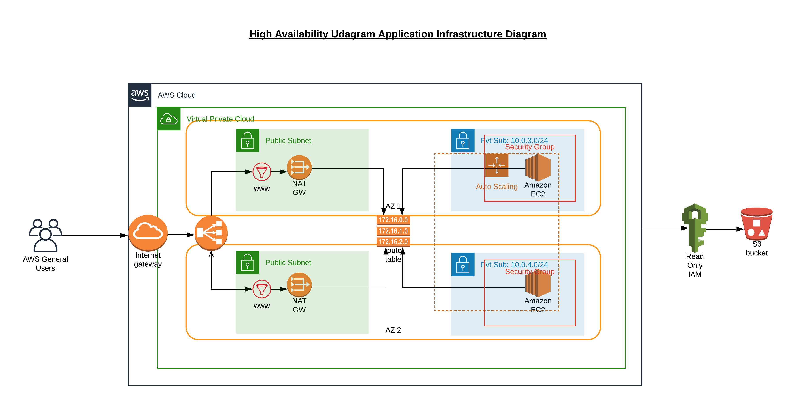

# Deploy a high-availability web app using CloudFormation Script

In this project we are supposed to deploy a High Availability app like an Instagram called "Udagram". Given the Startup configuration we are called to code a cloud infrastructure and method to deploy this Application.

### Requirement
-   02 vCPUs and at least 4GB of RAM and 10GB od Disk Space
-   Autoscaling capability across two availability zones
-   Application code placed in S3 Bucket

### Infrastructure Diagram

### Deployment:

Please run the following script on terminal:
1.  `./create.sh UdagramAppProject deploy-network.yml network-para.json`

2. `./update.sh UdagramAppProject deploy-server.yml server-para.json`

### Credits:

[Udacity Cloud DevOps Engineer](https://www.udacity.com/course/cloud-dev-ops-nanodegree--nd9991) Nanodegree Program